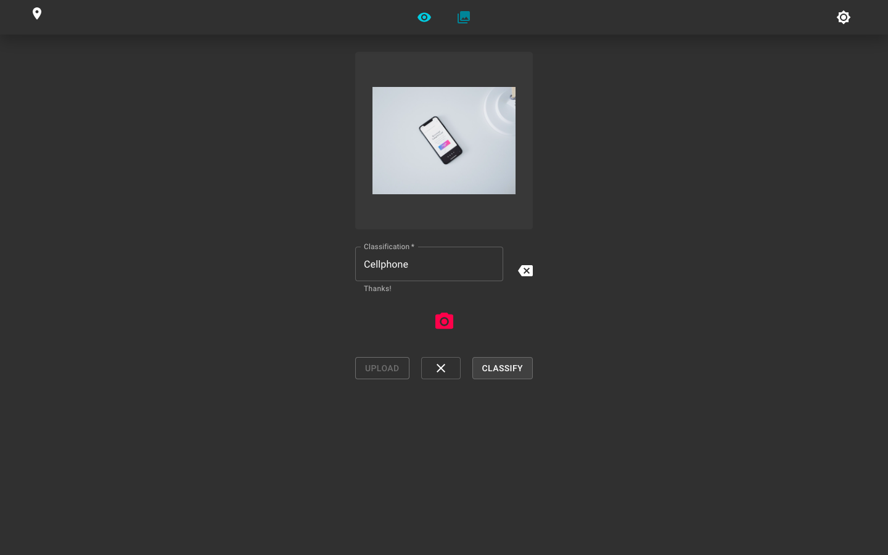
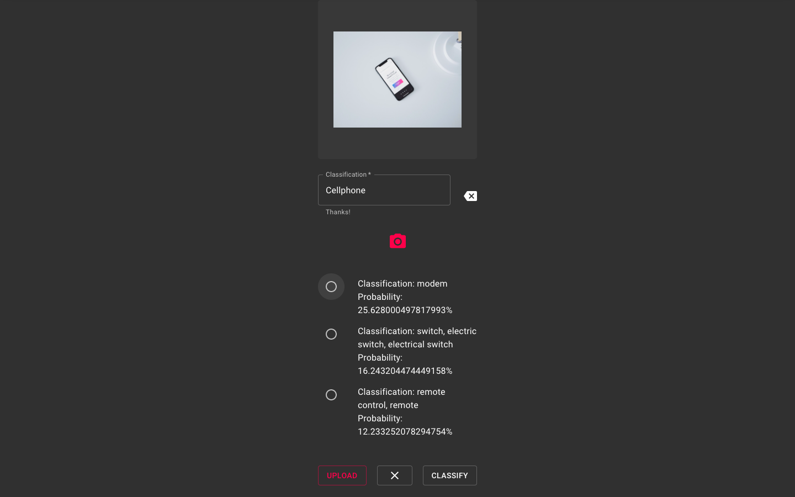

## General info
What Where When (Work-In-Progress)
Application for storing images with possibility of image classification.

## Screenshots
Current state of application.

## Functionality
* Upload images and get classification and probability from TensorFlow
* Render list of images and info
* Edit title
* Delete record

## Technologies
* React
* NodeJS
* MongoDB Atlas
* Cloudinary
* TensorFlow

