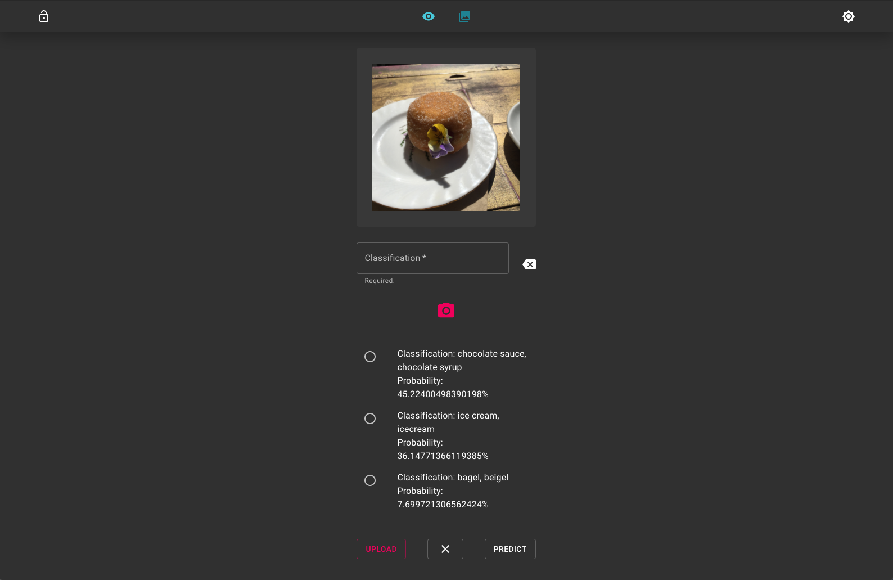

## General info
What Where When (Work-In-Progress)
Simple app for storing images with possibility of image prediction.

## Screenshots
Current state of application.

## Functionality
* Upload images and get classification and probability from TensorFlow
* Render list of images and info
* Edit and delete title

## Technologies
* React
* NodeJS
* MongoDB Atlas
* Cloudinary
* TensorFlow

